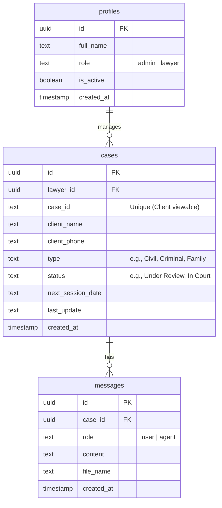

# سَنَد | الشريك القانوني الذكي بالذكاء الاصطناعي (SANAD - AI Smart Legal Partner)

مستند تعريفي متكامل مُعد خصيصاً لمنصة **NotebookLM** لشرح وتوثيق خطوات نظام **سَنَد** ودورة الاستخدام الكاملة للمحامي والموكل، مع تضمين لقطات الشاشة الحية من النظام الفعلي وتفاصيل تجربة الاستخدام الواقعية.

---

## 1. نظرة عامة على المشروع (Project Overview)

منصة **سَنَد** هي نظام برمجيات كخدمة (SaaS) متكامل ومصمم خصيصاً لمكاتب المحاماة والاستشارات القانونية في مصر والوطن العربي. يدمج النظام بين أدوات إدارة المكاتب وقضايا الموكلين (Legal CRM) وبين قوة الذكاء الاصطناعي التوليدي ومحركات البحث المدعمة بالاسترجاع (RAG) لصياغة الدفاع القانوني وصحف الدعاوى وتقديم الاستشارات الفورية المتوافقة مع القانون المصري وأحكام محكمة النقض.

### المشكلة (The Problem):
يقضي المحامون ما يصل إلى 70% من وقتهم في البحث في ثنايا القوانين وأحكام محكمة النقض، وصياغة مذكرات الدفاع الطويلة يدوياً، بالإضافة لتلقي مكالمات يومية متتالية من الموكلين للاستفسار عن تطورات قضاياهم ومواعيد جلساتهم.

### الحل (The Solution):
توفر منصة **سَنَد**:
1. **مساعد قانوني ذكي (AI Legal Assistant)**: يقرأ ملفات القضايا الكبيرة (PDF، صور، نصوص) ويعالجها بسرعة وتكلفة منخفضة بفضل تقنية **Gemini Context Caching**، ويقوم بصياغة مذكرات دفاع احترافية جاهزة للطباعة.
2. **بوابة تتبع القضايا للموكلين (Client Portal)**: تتيح للموكل الاستعلام عن حالة قضيته والاطلاع على "الورقة الإلكترونية" والقرارات وتواريخ الجلسات القادمة ذاتياً باستخدام رقم القضية ورقم الهاتف دون الحاجة لإزعاج المحامي.
3. **نظام حجز الاستشارات وتنظيم العمل**: لوحة تحكم كاملة للمحامي لتنظيم جدول مواعيده، وإدارة قضايا عملائه، وتوثيق ملفاتهم سحابياً بشكل آمن.

---

## 2. البنية التقنية وهيكل المشروع (Technology Stack)

يتكون مشروع **سَنَد** من شقين متكاملين:

### أ. منصة المحامي الذكية (Lawyer's AI Workspace)
* **المسار في المشروع**: [agent law samar samier](file:///c:/Users/pc/Downloads/api/eng.abdelrahman.amr/agent%20law%20samar%20samier)
* **الرابط الفعلي للموقع**: `https://lawsamarsamier.vercel.app/`
* **التقنيات المستخدمة**:
  - **Next.js 14 (App Router) & TypeScript**: لبناء تطبيق ويب سريع وآمن ومتجاوب بالكامل.
  - **Google Gemini API**: كمحرك ذكاء اصطناعي لتوليد المذكرات والاستشارات.
  - **Context Caching**: لحفظ سياق ملفات القضايا الضخمة والكتب القانونية لتقليل زمن الاستجابة والتكلفة.
  - **Supabase (Auth & Database)**: لإدارة حسابات المحامين وتخزين القضايا والرسائل والمراجع القانونية.
  - **Amiri Font & A4 PDF Printer Engine**: لتنسيق مذكرات الدفاع بالخط الأميري والهوامش الرسمية المعتمدة في المحاكم المصرية وتصديرها كملفات PDF جاهزة للتوقيع والتقديم فوراً.

### ب. موقع المكتب وبوابة الموكلين للخدمات القانونية (Law Firm Web Portal)
* **المسار في المشروع**: [samar samier](file:///c:/Users/pc/Downloads/api/eng.abdelrahman.amr/samar%20samier)
* **الرابط الفعلي للموقع**: `https://sanad-law.vercel.app/lawyers/mohamed.saed`
* **التقنيات المستخدمة**:
  - **React.js & Vite**: لبناء واجهة سريعة وخفيفة للعملاء والموكلين.
  - **Lucide Icons & CSS3**: لتصميم لوحة تحكم أنيقة وعصرية (باللونين الكحلي الداكن والذهبي الفاخر).
  - **Case Tracking Engine**: نظام استعلام للموكلين يبحث مباشرة في قاعدة بيانات Supabase المشتركة ليعرض حالة قضاياهم وجلساتهم.

---

## 3. هيكل قاعدة البيانات والعلاقات (Database Schema)

تعتمد المنصة على الجداول التالية في **Supabase (PostgreSQL)** لضمان تكامل البيانات:

1. **جدول الملفات الشخصية (profiles)**: يربط حساب المحامي في Supabase Auth ويخزن دوره وحالة حسابه.
2. **جدول القضايا (cases)**: يحتوي على تفاصيل القضية الأساسية، واسم الموكل ورقم هاتفه ورقم القضية الفريد للاستعلام، بالإضافة لموعد الجلسة وحالة القضية وتحديثاتها.
3. **جدول الرسائل (messages)**: يسجل تاريخ المحادثات بين المحامي ومساعد الذكاء الاصطناعي "سَنَد" لكل قضية على حدة لضمان استمرارية السياق القانوني.

---

## 4. دورة الاستخدام والتجربة العملية (Walkthrough & User Experience)

فيما يلي خطوات استخدام المنصة وتجربتها بشكل عملي على الموقع الحي، بداية من تسجيل دخول المحامي وإدارة القضايا والاستشارة وصياغة المرافعة، ووصولاً لدخول الموكل لمتابعة قضيته وتصدير التقرير الرسمي.

### بيانات الدخول الافتراضية للمحامي (Lawyer Credentials):
* **البريد الإلكتروني**: `mohamed.saed@gmail.com`
* **كلمة المرور**: `123456`

---

### الخطوة 1: تسجيل دخول المحامي إلى مساحة العمل الذكية
يفتح المحامي شاشة تسجيل الدخول المخصصة للمكتب، ويدخل بريده الإلكتروني وكلمة المرور المشفرة للوصول إلى لوحة التحكم الخاصة به.

* **لقطة شاشة حية لصفحة تسجيل دخول المحامي:**

* **لقطة شاشة حية للوحة التحكم والمساحة الخاصة بالمحامي بعد تسجيل الدخول:**

---

### الخطوة 2: إضافة قضية جديدة برقم الموكل وبياناته
يقوم المحامي بفتح لوحة الإدارة لإضافة قضية جديدة في النظام لكي يتمكن موكله من تتبعها ذاتياً.
* يضغط المحامي على زر **إضافة قضية جديدة**.
* يقوم بإدخال البيانات كالتالي:
  - **رقم القضية (معرف فريد)**: `CASE-2026-991`
  - **اسم الموكل**: أحمد محمود عبد الصمد
  - **رقم هاتف الموكل**: `01012345678`
  - **نوع القضية**: أسرة - طلاق للضرر بسبب الهجر
  - **حالة القضية**: قيد المرافعة
  - **تاريخ الجلسة القادمة**: `2026/12/7`
  - **آخر تحديث للموكل**: "تم إعداد مذكرة الدفاع وجاري تقديمها للمحكمة."

---

### الخطوة 3: التحدث مع "سَنَد" في جلسة استشارة قانونية (Consultation)
ينتقل المحامي إلى نافذة الشات الذكي مع "سَنَد" لبدء الاستشارة حول القضية الجديدة. يتم الحديث بـ **لغة المحامين البلاغية والمهنية الدقيقة** للحصول على أدق تكييف قانوني.

#### نص محادثة الاستشارة القانونية:

* **المحامي (أ. محمد سعيد)**:
> "سيدي المستشار، بصفتي وكيلاً عن المدعية في الدعوى المقيدة برقم `CASE-2026-991` أحوال شخصية، والمرفوعة بطلب التطليق للضرر لاستحكام النفور والهجر لأكثر من عام ونصف بدون عذر. أرجو من سيادتكم تقديم تكييف قانوني دقيق للواقعة استناداً لأحكام محكمة النقض المصرية ومواد القانون رقم 25 لسنة 1920 المعدل بالقانون رقم 100 لسنة 1985، وتوضيح شروط قبول الدعوى ووسائل الإثبات المقبولة أمام محكمة الأسرة."

* **المستشار الذكي (سَنَد)**:
> "الأستاذ الفاضل زميلي العزيز، وعناية بالطلب المقدم من سيادتكم وتكييفاً للواقعة المعروضة:
> 
> أولاً: **التكييف القانوني وسند الدعوى**:
> تندرج دعوى موكلتكم تحت نص **المادة 6 من القانون رقم 25 لسنة 1920** بشأن أحكام الأحوال الشخصية، والتي نصت على أنه: (إذا ادعت الزوجة إضرار الزوج بها بما لا يستطاع معه دوام العشرة بين أمثالهما، يجوز لها أن تطلب من القاضي التفريق، وحينئذ يطلقها القاضي طلقة بائنة إذا ثبت الضرر وعجز عن الإصلاح بينهما).
> 
> ثانياً: **شروط قبول دعوى التطليق للهجر**:
> 1. ثبوت غيبة الزوج أو هجره لزوجته مدة سنة فأكثر (وفي حالتكم الثابت هو عام ونصف).
> 2. أن يكون الهجر بلا عذر مقبول أو مبرر شرعي.
> 3. إلحاق ضرر حقيقي بالزوجة جراء هذا الهجر (ضرر نفسي ومادي بانتفاء مقاصد الزواج).
> 
> ثالثاً: **طرق الإثبات المقررة قانوناً وأحكام النقض**:
> - **شهادة الشهود**: وهي عماد الإثبات في دعاوى الضرر، حيث يُستمع لشهادة شاهدين عدلين لتأكيد واقعة عدم حضور الزوج وإقامته خارج مسكن الزوجية وهجره للمدعية.
> - **أحكام محكمة النقض المرتبطة**: استقرت أحكام نقضنا على أن (الضرر المبيح للتطليق هو الضرر الذي لا يستطاع معه دوام العشرة، وتقدير توافر الضرر أو نفيه من سلطة محكمة الموضوع ما دامت تقيم قضاءها على أسباب سائغة ولها أصلها الثابت بالأوراق)."

* **لقطة شاشة حية لواجهة المحادثة والاستشارة القانونية مع "سَنَد":**

---

### الخطوة 4: التحدث مع "سَنَد" لصياغة مذكرة دفاع (Court Brief Drafting)
بعد الاستقرار على التكييف القانوني، يطلب المحامي من "سَنَد" صياغة مسودة عريضة الدعوى ومذكرة الدفاع بشكل رسمي لتقديمها أمام هيئة المحكمة.

#### نص محادثة صياغة المرافعة وكتابة المذكرة:

* **المحامي (أ. محمد سعيد)**:
> "سيادة المستشار، بناءً على التكييف السابق، يرجى صياغة مذكرة دفاع متكاملة موجهة إلى رئيس محكمة الأسرة بـ (الخليفة)، نتمسك فيها بطلب التطليق للضرر للزوجة وضمان حقوقها الشرعية، مع صياغة الدفوع القانونية الآتية:
> 1. الدفع بثبوت الضرر المتمثل في الهجر الطويل بغير عذر شرعي لأكثر من عام ونصف.
> 2. الدفع باستحكام النفور واستحالة العشرة الزوجية وسقوط محاولات الصلح.
> 3. طلب الحكم بتطليق المدعية طلقة بائنة للضرر مع إلزام المدعى عليه بالمصاريف وأتعاب المحاماة."

* **المستشار الذكي (سَنَد)**:
> "حاضر يا أستاذي، إليك مسودة المذكرة القانونية مصاغة وفقاً للقواعد المهنية المتبعة أمام محاكم الأسرة المصرية، وجاهزة للتنسيق الفوري والطباعة:"

* **لقطة شاشة حية لواجهة صياغة وتعديل المذكرات القانونية والمرافعة:**

---

### الخطوة 5: تصدير وطباعة المذكرة بتنسيق المحاكم الرسمي (PDF)
عند اكتمال المذكرة، يضغط المحامي على زر **"طباعة المذكرة (PDF)"** في المنصة. 
يقوم النظام بتنسيق المستند تلقائياً ليلائم معايير المحاكم المصرية:
* استخدام **الخط الأميري (Amiri Font)** التقليدي ذو الهيبة القانونية.
* ضبط الهوامش القانونية (2 سم من كافة الاتجاهات) لترك مساحة لملف القضية والقلم.
* تنسيق أحجام العناوين والنصوص لسهولة القراءة من قِبل هيئة المستشارين في المحكمة.

* **لقطة شاشة حية لنافذة المعاينة والطباعة الرسمية للمذكرة:**

---

### الخطوة 6: تتبع الموكل لقضيته عبر بوابة الموكلين الذاتية وتصدير تقرير PDF
بعد قيد القضية وتحديث حالتها في لوحة التحكم، يمكن للموكل تتبع مسار القضية ذاتياً دون إزعاج المحامي بالاتصال الهاتفي:
1. يفتح الموكل الموقع الإلكتروني لمكتب المحامي (محمد سعيد).
2. يتوجه إلى صفحة **تتبع حالة القضية (Case Tracking)**.
3. يدخل البيانات للتحقق والأمان:
   - **رقم القضية**: `CASE-2026-991` 
   - **رقم الهاتف المسجل**: `01012345678`
4. يضغط على **بحث عن القضية**.
5. يظهر له تقرير متكامل ومحدث يحتوي على:
   - حالة القضية الحالية: **قيد المرافعة**.
   - موعد الجلسة القادمة: `2026/12/7` (تاريخ الجلسة القادمة المحدث).
   - التحديث الأخير والتوجيهات من المحامي: "تم إعداد مذكرة الدفاع وجاري تقديمها للمحكمة."
6. يضغط الموكل على زر **"تصدير PDF"** أو طباعة التقرير، لتظهر له نافذة تحتوي على التقرير الرسمي المنسق والمحمي بعلامة مائية لاسم المحامي.

* **لقطة شاشة حية لصفحة الاستعلام ونتائج تتبع القضية من طرف الموكل:**

* **لقطة شاشة حية لتقرير حالة الدعوى الرسمي الصادر للموكل بصيغة PDF:**

---

## 5. الخلاصة والقيمة الاستثمارية (Conclusion & Business Value)

منصة **سَنَد** تمثل نموذجاً حقيقياً لكيفية تطويع تقنيات الذكاء الاصطناعي الحديثة (مثل LLMs والـ RAG وContext Caching) لخدمة مهنة المحاماة التقليدية.
* **الكفاءة الزمنية**: تقلص المنصة وقت إعداد القضايا وصياغة الدفاع من أيام إلى دقائق معدودة.
* **التواصل الفعال**: تبني المنصة جسر ثقة رقمي مع الموكلين عبر تمكينهم من الاطلاع الفوري والذاتي على قضاياهم مما يرفع من جودة الخدمة ورضا العملاء.
* **الهيبة المهنية**: تصدير المستندات والتقارير الرسمية بالخط الأميري والتنسيق المعتمد بعلامة مائية مخصصة يمنح مذكرات مكتب المحاماة رونقاً وطابعاً رسمياً يترك انطباعاً ممتازاً أمام هيئة القضاء والموكلين.
